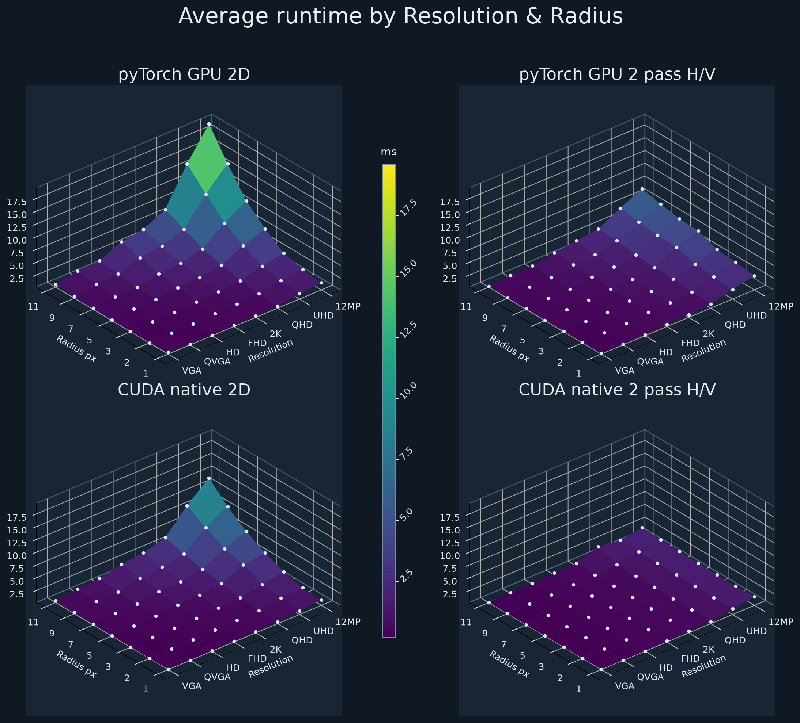

# PyTorch and CUDA Image Blur Experiments

A small curiosity-driven project for learning how CUDA kernels, PyTorch GPU operations, and memory access patterns affect image-processing performance.

The benchmark resizes source images from `images/` to resolutions from VGA through 12 MP, then applies a box blur with radii from 1 to 11. It records the runtime of four implementations:

- PyTorch GPU 2D convolution.
- PyTorch two-pass horizontal/vertical 1D convolution.
- A native CUDA 2D box-blur kernel.
- A native CUDA two-pass implementation using shared-memory tiles and halo regions.

## What I learned

The results make the cost of a full 2D blur visible: its work grows with `(2r + 1)^2`. Splitting the box blur into horizontal and vertical passes reduces that work to `2 * (2r + 1)`, which becomes increasingly useful with larger blur radii. The native CUDA version also provides a practical introduction to thread blocks, shared memory, halo loading, and PyTorch C++/CUDA extensions.

This is an exploratory learning project rather than a production-ready image library. Exact timings depend on the GPU, CUDA/PyTorch versions, and image sizes.

## Benchmark Visualization



## Run

Build the CUDA extension, run the benchmark, then generate the chart:

```bash
python setup.py build_ext --inplace
python main.py
python drawgraphs.py
```

Benchmark parameters, including resolutions, blur radii, and run count, are defined in `config.py`.
